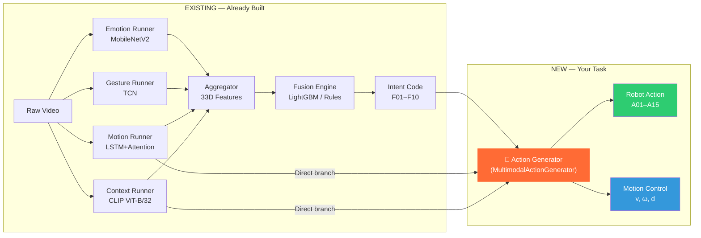
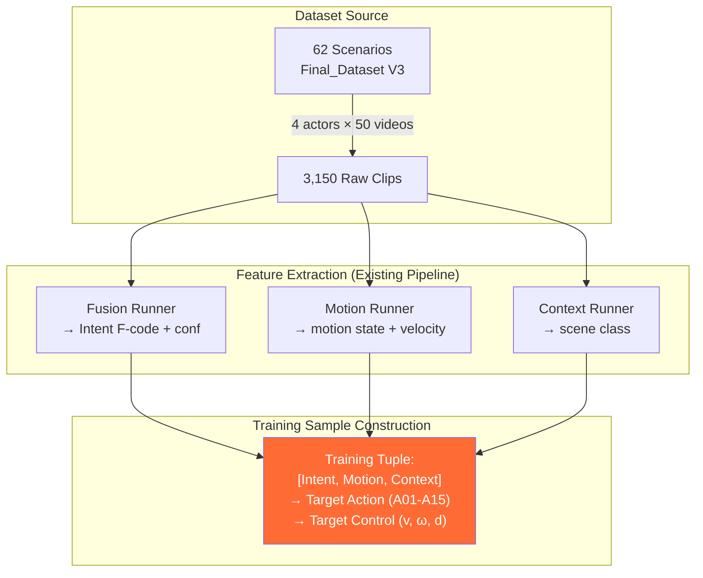
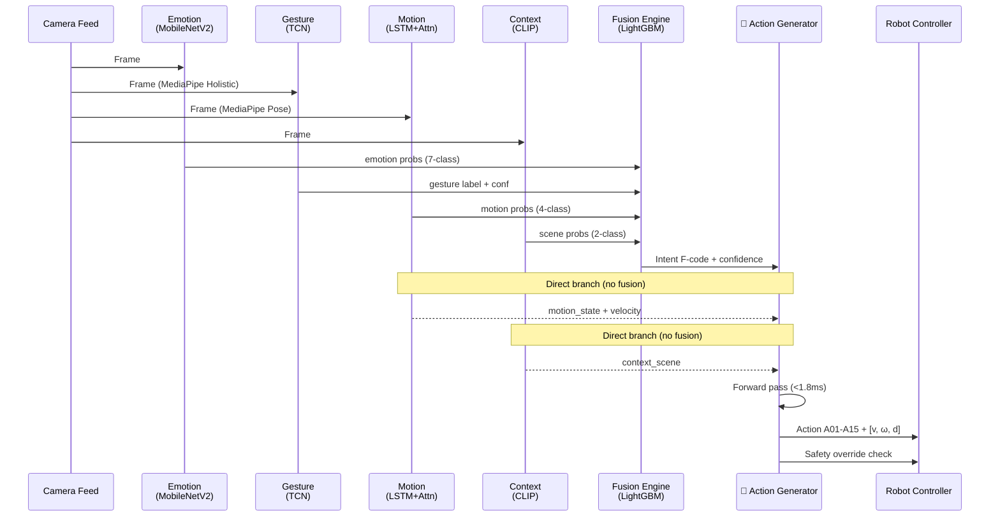

# Action Generator: Architecture, Training & Deployment Plan

## 1. Understanding — Where Does the Action Generator Fit?

Your current pipeline has **two tiers** that already work:



### The Key Insight

The **Fusion Engine** (existing) predicts *what the human wants* (Intent F01–F10). The **Action Generator** (your task) predicts *what the robot should DO about it* (Action A01–A15 + velocity/safety controls). The Action Generator needs **three direct inputs**:

| Input | Source | What It Carries |
|---|---|---|
| **Intent** (F01–F10) + confidence | Fusion Engine output | *What* the human wants |
| **Motion** (sit/stand/walk/step_back) + velocity | Motion Runner (direct branch) | Human's physical state — for **safety** |
| **Context** (classroom/kitchen) | Context Runner (direct branch) | *Where* the interaction happens — action meaning changes with environment |

> [!IMPORTANT]
> Motion and Context feed **both** the Fusion Engine (for intent classification) **AND** the Action Generator directly. This is the "another branch" you mentioned — the Action Generator gets a direct line to motion/context because the *same intent* (e.g. F02 Emergency) requires *different actions* depending on context (kitchen fire → A02, classroom hazard → A14) and motion state (seated/fall → A03 medical, standing → A02 fire alert).

---

## 2. Model Architecture — `MultimodalActionGenerator`

### 2.1 Why This Architecture Is Lightweight Enough for Jetson Orin Nano

| Metric | Value |
|---|---|
| Total Parameters | ~26K |
| Model Size | ~104 KB |
| Inference Latency | < 1.8 ms on Orin Nano |
| Memory Footprint | < 1 MB |
| Format | ONNX (post-training export) |

Compare this to your existing Motion LSTM (~270K params, ~1.1 MB) — the Action Generator is **10× smaller**.

### 2.2 Architecture Diagram

```
┌──────────────────────────────────────────────────────────────────┐
│                   MultimodalActionGenerator                       │
│                                                                   │
│  ┌─────────────┐  ┌─────────────┐  ┌─────────────┐              │
│  │ Intent Code  │  │ Motion State │  │ Context Scene│              │
│  │  F01–F10     │  │ 4 classes    │  │ 2 classes    │              │
│  │  + confidence│  │ + velocity   │  │              │              │
│  └──────┬───────┘  └──────┬───────┘  └──────┬───────┘              │
│         │                  │                  │                     │
│    ┌────▼────┐        ┌────▼────┐        ┌────▼────┐              │
│    │Embedding │        │Embedding │        │Embedding │              │
│    │ 10→16D   │        │  4→16D   │        │  2→16D   │              │
│    └────┬────┘        └────┬────┘        └────┬────┘              │
│         │                  │                  │                     │
│    ┌────┴──────────────────┴──────────────────┴────┐              │
│    │  Concatenate: [e_intent ‖ conf ‖ e_motion ‖   │              │
│    │                v_human ‖ e_context]             │              │
│    │  → 64-dimensional feature vector               │              │
│    └─────────────────────┬──────────────────────────┘              │
│                          │                                         │
│    ┌─────────────────────▼──────────────────────────┐              │
│    │        Dense Fusion Core                        │              │
│    │  Layer 1: Linear(64 → 128) + LayerNorm + GELU  │              │
│    │           + Dropout(0.20)                        │              │
│    │  Layer 2: Linear(128 → 64) + LayerNorm + GELU  │              │
│    └────────────┬──────────────────┬────────────────┘              │
│                 │                  │                                │
│    ┌────────────▼────────┐  ┌─────▼──────────────┐                │
│    │  Head 1: Action     │  │  Head 2: Motion     │                │
│    │  Classifier         │  │  Controller         │                │
│    │  Linear(64→15)      │  │  Linear(64→3)       │                │
│    │  → Softmax          │  │  → [v, ω, d]        │                │
│    │  → A01–A15 probs    │  │  velocity, turning,  │                │
│    └─────────────────────┘  │  comfort distance    │                │
│                              └─────────────────────┘                │
└──────────────────────────────────────────────────────────────────┘
```

### 2.3 Mathematical Formulation

**Input Feature Vector:**
$$x = [e_{\text{intent}} \| c_{\text{intent}} \| e_{\text{motion}} \| v_{\text{human}} \| e_{\text{context}}] \in \mathbb{R}^{64}$$

Where:
- $e_{\text{intent}} \in \mathbb{R}^{16}$: Learnable embedding for intent F01–F10
- $c_{\text{intent}} \in \mathbb{R}^{1}$: Intent confidence score (from Fusion Engine)
- $e_{\text{motion}} \in \mathbb{R}^{16}$: Learnable embedding for motion state
- $v_{\text{human}} \in \mathbb{R}^{15}$: Human velocity features (from Motion Runner — camera angle, speed, direction)
- $e_{\text{context}} \in \mathbb{R}^{16}$: Learnable embedding for context scene

**Dense Fusion Core:**
$$h_1 = \text{GELU}(\text{LayerNorm}(W_1 \cdot x + b_1)), \quad W_1 \in \mathbb{R}^{128 \times 64}$$
$$h_2 = \text{GELU}(\text{LayerNorm}(W_2 \cdot \text{Dropout}(h_1, p=0.2) + b_2)), \quad W_2 \in \mathbb{R}^{64 \times 128}$$

**Head 1 — Action Classification:**
$$P(A_{01} \ldots A_{15}) = \text{Softmax}(W_{\text{act}} \cdot h_2 + b_{\text{act}}) \in \mathbb{R}^{15}$$

**Head 2 — Motion Control (for safety/velocity):**
$$[v, \omega, d] = W_{\text{ctrl}} \cdot h_2 + b_{\text{ctrl}} \in \mathbb{R}^{3}$$

Where $v$ = linear velocity, $\omega$ = angular velocity, $d$ = comfort distance.

---

## 3. Training Pipeline

### 3.1 Dataset Construction from Final_Dataset.pdf

Your 62-scenario table provides the ground-truth mapping. Each scenario becomes multiple training samples:



**Step-by-step dataset construction:**

1. **Extract from scenarios table** — Each of the 62 scenarios defines:
   - Input cues: emotion, gesture, motion, context
   - Ground truth intent: F01–F10
   - Ground truth action: A01–A15
   
2. **Build training tuples** — For each scenario:
   ```
   Input:  [intent_code, intent_confidence, motion_state, human_velocity, context_scene]
   Target: [action_code, linear_vel, angular_vel, comfort_dist]
   ```

3. **Augmentation via modality dropout** — During training, randomly mask context with 15% probability → teaches the model to handle sensor failure.

4. **Control signal ground truth** — Derive velocity/distance targets from the action semantics:

| Action | Linear Velocity $v$ | Angular Velocity $\omega$ | Comfort Distance $d$ |
|---|---|---|---|
| A01 (Acknowledge) | 0.0 m/s | 0.0 rad/s | 1.0 m |
| A02 (Fire alert) | 0.0 m/s | 0.0 rad/s | 2.0 m |
| A03 (Medical alert) | 0.0 m/s | 0.0 rad/s | 2.0 m |
| A04 (Approach spot) | 0.3 m/s | variable | 0.8 m |
| A05 (Offer guidance) | 0.0 m/s | 0.1 rad/s | 1.0 m |
| A06 (Hold position) | 0.0 m/s | 0.0 rad/s | 1.5 m |
| A07 (Suggest break) | 0.0 m/s | 0.0 rad/s | 1.2 m |
| A08 (De-escalation) | 0.0 m/s | 0.05 rad/s | 1.5 m |
| A09 (Wave back) | 0.0 m/s | 0.0 rad/s | 1.5 m |
| A10 (Farewell hold) | 0.0 m/s | 0.0 rad/s | 1.5 m |
| A11 (Move aside) | 0.3 m/s | 0.5 rad/s | 0.5 m |
| A12 (Encourage) | 0.0 m/s | 0.0 rad/s | 1.0 m |
| A13 (Follow/fetch) | 0.4 m/s | variable | 1.0 m |
| A14 (Halt risky) | 0.0 m/s | 0.1 rad/s | 1.8 m |
| A15 (Ask clarification) | 0.0 m/s | 0.0 rad/s | 1.0 m |

### 3.2 Training Procedure

```
┌─────────────────────────────────────────────────────┐
│              TRAINING LOOP (100 epochs)              │
│                                                      │
│  For each batch:                                     │
│    1. Sample (Intent, Motion, Context) tuples        │
│    2. Apply Modality Dropout (15% context masking)   │
│    3. Forward pass → action probs + control values   │
│    4. Compute Multi-Task Loss:                       │
│       L = L_focal(action) + 0.5 × L_huber(control)  │
│    5. Backprop with AdamW optimizer                  │
│    6. Cosine Annealing LR decay (1e-3 → 1e-5)       │
│                                                      │
│  Total training time: ~30 seconds (tiny model!)      │
└─────────────────────────────────────────────────────┘
```

**Why Focal Loss?**
- Some actions are rare but safety-critical (A02 fire alert, A03 medical, A14 classroom hazard)
- Focal Loss down-weights easy/frequent classes, focusing learning on hard/rare cases
- Formula: $FL(p_t) = -\alpha_t(1 - p_t)^\gamma \log(p_t)$, with $\gamma = 2$

**Why Huber Loss for control?**
- Robust to outlier velocity targets
- Smoother gradients than MSE for the comfort-distance predictions

### 3.3 Safety Override (Critical for Deployment)

Post-prediction hard rule — **not learned, always enforced**:

```python
if intent == "F02" or action_probs["A02"] > 0.15 or action_probs["A03"] > 0.15:
    action = "A02" if context == "kitchen" else "A14"  # fire vs classroom hazard
    linear_velocity = 0.0   # HALT
    comfort_distance = 2.0  # MAX SAFETY DISTANCE
```

This mirrors the existing F02 safety override in your Fusion Engine's GBT model.

---

## 4. How the Full System Works at Runtime

### 4.1 Complete Data Flow



### 4.2 Runtime Example

```json
// Step 1: Fusion Engine output
{ "intent": "F02", "confidence": 0.92 }

// Step 2: Direct motion branch
{ "motion": "step_back", "velocity": 0.8 }

// Step 3: Direct context branch
{ "context": "classroom" }

// Step 4: Action Generator inference (<1.8 ms)
{
  "action": "A14",
  "description": "Halt risky action; check surroundings; notify supervisor",
  "confidence": 0.974,
  "probabilities": { "A14": 0.974, "A02": 0.012, "A06": 0.008 },
  "control": {
    "linear_velocity_m_s": 0.0,
    "angular_velocity_rad_s": 0.1,
    "comfort_distance_m": 1.8
  }
}
```

---

## 5. Proposed Implementation — File Structure

### New files to create:

```
d:\fusion-engine\
├── action_generator/                    # NEW MODULE
│   ├── __init__.py
│   ├── model.py                         # MultimodalActionGenerator (PyTorch nn.Module)
│   ├── dataset.py                       # ActionDataset class + augmentation
│   ├── train.py                         # Training loop with Focal + Huber loss
│   ├── inference.py                     # ActionInference runtime wrapper
│   ├── config.py                        # Hyperparameters, action/intent mappings
│   ├── export_onnx.py                   # ONNX export for Jetson deployment
│   └── safety_override.py              # Hard-coded safety rules (never learned)
```

### [NEW] `action_generator/config.py`
- Intent codes F01–F10 vocabulary + embeddings
- Motion states (sit, stand, walk, step_back) vocabulary
- Context scenes (classroom, kitchen) vocabulary  
- Action codes A01–A15 with descriptions and default control values
- Hyperparameters: embedding_dim=16, hidden_dim=128, dropout=0.20, lr=1e-3

### [NEW] `action_generator/model.py`
- `MultimodalActionGenerator(nn.Module)` with:
  - 3 embedding tables (intent, motion, context)
  - 2-layer Dense Fusion Core (64→128→64 with LayerNorm + GELU + Dropout)
  - Head 1: Action classifier (Softmax over A01–A15)
  - Head 2: Motion controller ([v, ω, d])
  - `count_parameters()` method (target: ~26K)

### [NEW] `action_generator/dataset.py`
- `ActionDataset(torch.utils.data.Dataset)` that:
  - Loads scenario tuples from Final_Dataset V3
  - Applies modality dropout (15% context masking)
  - Returns (intent_idx, intent_conf, motion_idx, velocity, context_idx) → (action_idx, control_targets)

### [NEW] `action_generator/train.py`
- Training loop: 100 epochs, AdamW + Cosine Annealing
- Multi-task loss: Focal Loss (action) + 0.5 × Huber Loss (control)
- Logs metrics to MLflow (reuses existing `tracking/mlflow_setup.py`)
- Saves best checkpoint by validation action accuracy

### [NEW] `action_generator/inference.py`
- `ActionInference` class wrapping the trained model
- Accepts (intent, confidence, motion_state, velocity, context) 
- Returns action code, probabilities, and control signals
- Applies safety override post-prediction

### [NEW] `action_generator/export_onnx.py`
- Exports trained model to ONNX format
- Validates ONNX model output matches PyTorch output
- Optimizes for Jetson Orin Nano (FP16 quantization option)

---

## 6. Integration with Existing Pipeline

The Action Generator plugs into the **end** of your current pipeline:

```python
# In the main inference loop (pseudocode):

# 1. Existing modules (already working)
emotion_result = emotion_runner.update(frame)
gesture_result = gesture_runner.update(frame)
motion_result  = motion_runner.update(frame)    # Also feeds Action Generator directly
context_result = context_runner.update(frame)    # Also feeds Action Generator directly

# 2. Existing Fusion Engine
intent_code, intent_conf = fusion_engine.predict(
    emotion_result, gesture_result, motion_result, context_result
)

# 3. NEW — Action Generator
action_result = action_generator.predict(
    intent=intent_code,           # From Fusion Engine
    intent_confidence=intent_conf,
    motion_state=motion_result.label,     # Direct branch from Motion Runner
    velocity=motion_result.velocity,       # Camera angle / speed features
    context=context_result.scene           # Direct branch from Context Runner
)

# 4. Send to robot
robot.execute(action_result.action, action_result.control)
```

---

## 7. Verification Plan

### Automated Tests
- Unit test: Model forward pass shape correctness
- Unit test: Safety override always triggers on F02
- Unit test: ONNX export matches PyTorch output within tolerance
- Training smoke test: 5-epoch run, verify loss decreases

### Manual Verification
- Action accuracy on held-out test scenarios (21 test scenarios)
- Per-action recall (especially safety-critical A02, A03, A14)
- Inference latency benchmark on Jetson Orin Nano (< 2ms target)
- End-to-end pipeline test: camera → perception → fusion → action → robot command

---

## Open Questions

> [!IMPORTANT]
> **Q1: Velocity features** — The `how_action_generator_trains_and_works.pdf` mentions `v_human` (human velocity) as part of the 64D input. Your Motion Runner currently outputs `(label, confidence, probs)` but not raw velocity. Should I:
> - (a) Extract velocity from the Motion Runner's skeleton data (hip displacement per frame) — **recommended**
> - (b) Use just the motion label + confidence without velocity features

> [!IMPORTANT]
> **Q2: Direction feature** — The Final_Dataset V3 includes a `Direction` column (toward robot, away from robot, lateral, stationary) which is critical for distinguishing F06 (passage request) from F05 (busy). Should I:
> - (a) Add direction as a 4th input to the Action Generator — **recommended** (makes the 64D vector: intent_emb(16) + conf(1) + motion_emb(16) + direction_emb(8) + velocity(7) + context_emb(16) = 64)
> - (b) Keep it as 3 inputs only, relying on the Fusion Engine to encode direction into the intent

> [!IMPORTANT]
> **Q3: Intent expansion** — Your `how_action_generator_trains_and_works.pdf` mentions F01–F15 (15 intents) and A01–A15 (15 actions), but the Final_Dataset V3 only defines F01–F10 (10 intents). Which should I implement?
> - (a) F01–F10 matching the current dataset (and expand later)
> - (b) F01–F15 as a forward-looking design

> [!NOTE]
> **Q4: Camera angle** — You mentioned wanting to use camera angle for safety. This can be derived from the MediaPipe Pose landmarks (shoulder-to-hip vector relative to camera plane). Shall I include this as part of the velocity features sent to the Action Generator?
